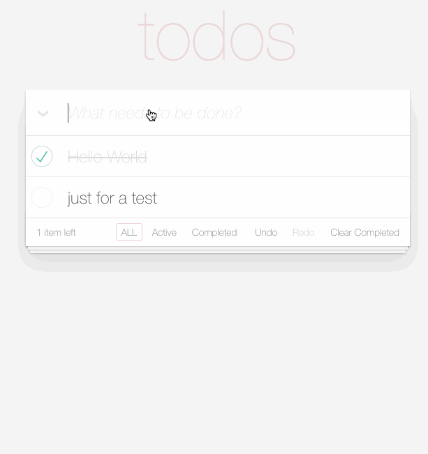

## Pre work - Todo List

#### 项目简介
待办事项网站，简易Todo List的小Demo，主要使用技术 Django, Django Rest Framework, React， Redux

#### 项目基本功能
- [x] 列出所有的待办事项
- [x] 切换已完成、未完成和所有待办事项列表
- [x] 显示剩余事项的个数
- [x] 增加一个待办事项
- [x] 删除一个待办事项
- [x] 标记一个待办事项为已完成
- [x] 取消标记一个已完成的待办事项
- [x] 反选所有待办事项
- [x] 清除所有已完成事项
- [ ] Undo、Redo（仅前端部分，暂未完成后台接口）

项目功能展示




#### 项目待完成功能
- [ ] 编辑一个待办事项的具体内容
- [ ] 待办事项可以设置优先级
- [ ] 待办事项可以设置expire date
- [ ] 支持按照不同的方式排序，如优先级，expire date


#### 使用方法
clone repository
```git
git clone git@github.com:iplaces/Django-TodoList.git
```

安装依赖
```
npm install
pip install -r requirements.txt
```

运行项目
```
npm start
python manage.py runserver
```